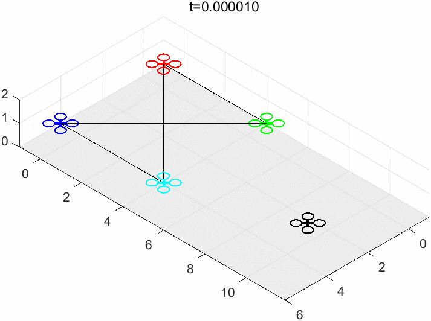
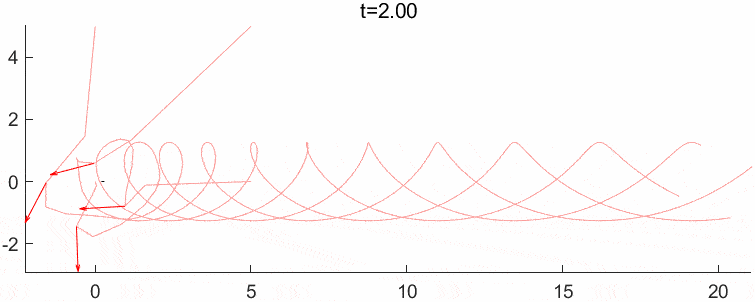
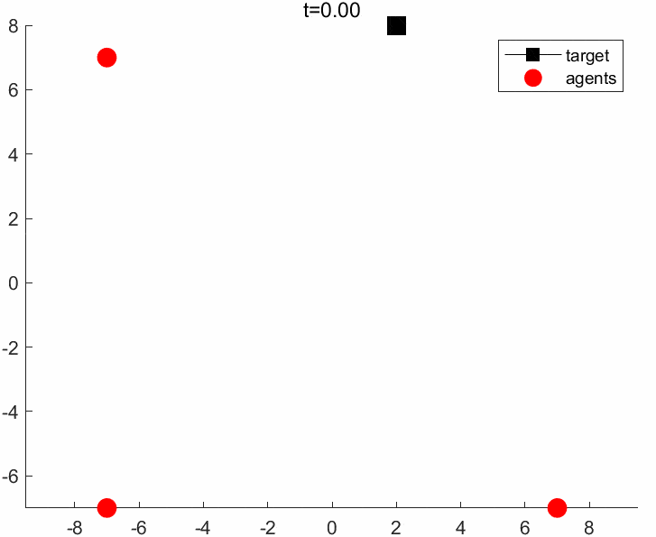
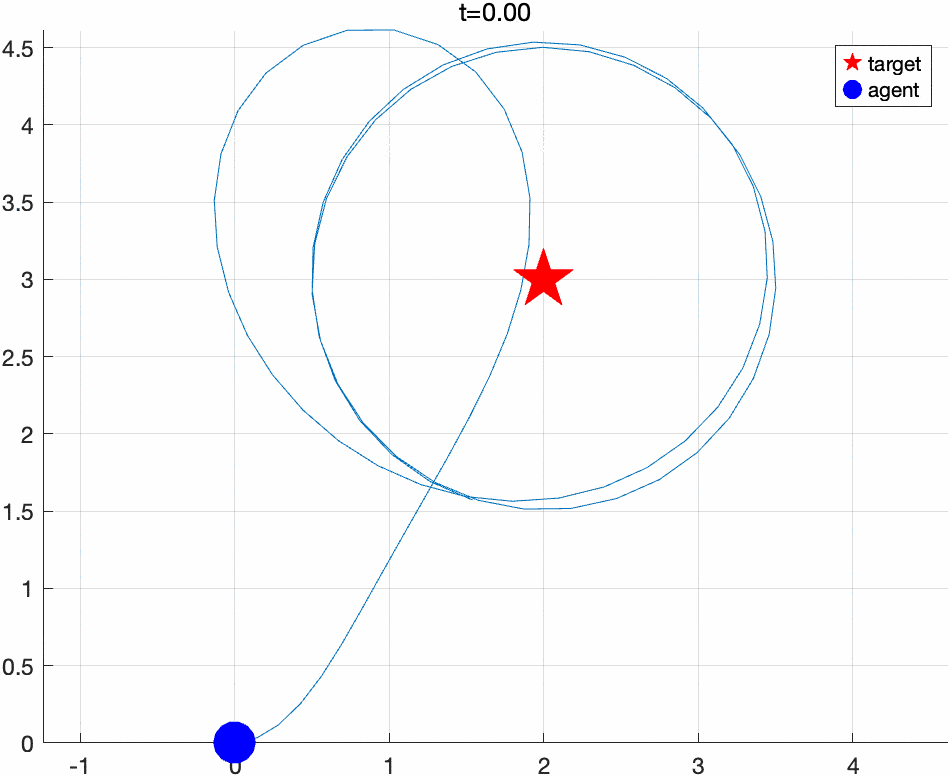
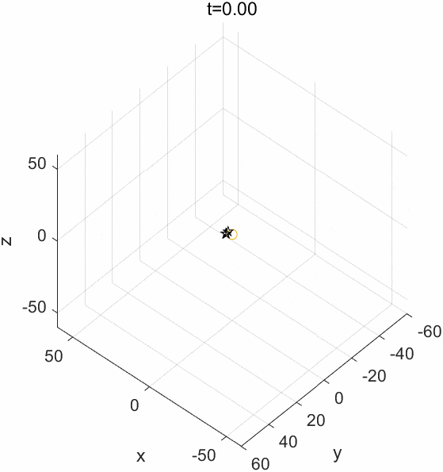

# cooperative-fencing-simulation
Collection of simulations of [FENCING](https://doi.org/10.1016/j.automatica.2019.05.034) algorithms  and something relevant to this in Multiagent System.

Each folder of this project's root folder is a standalone simulation.
`main*.m` is the entry of each simulation.

## Results

### [A cooperative target-fencing protocol of multiple vehicles](https://doi.org/10.1016/j.automatica.2019.05.034)

### [基于输出反馈线性化的多移动机器人目标包围控制](https://doi.org/10.16383/j.aas.c200335)

Why the formation rotate about the target while the simulation in the original paper does not?

### [Cooperative Label-Free Moving Target Fencing for Second-Order Multi-Agent Systems with Rigid Formation](https://doi.org/10.1016/j.automatica.2024.111558)

## Single agent encircle one target

### [Target Circumnavigation of Mobile Robots in GPS-Denied Environments](https://ieeexplore.ieee.org/Xplorehelp/downloads/license-information/IEEE.html)

## Multi agents encircle one target

### [Collective circular motion of multi-vehicle systems](https://linkinghub.elsevier.com/retrieve/pii/S0005109808002951)

## Multi agents encircle multi targets

### [Time-Varying Formation Tracking for Linear Multiagent Systems With Multiple Leaders](https://doi.org/10.1109%2FTAC.2017.2673411)

## relavant projects

For more projects about multi-agent you may see [formation-control](https://github.com/topics/formation-control).

- Python and MATLAB implementations of Flocking Algorithms and Formation Control [Formation-Control](https://github.com/Sang-Buster/Formation-Control)
- Multi-robot control simulation environmrnt build on top on Mobile Robotics Simulation Toolbox, implemented 1)some algorithm for formation control 2)mapping, localization and SLAM based on Kalman filter.. [SwarmSim](https://github.com/yxiao1996/SwarmSim)
- Let's reproduce paper simulations of multi-robot systems, formation control, distributed optimization and cooperative manipulation. [star2dust/paper-simulation](https://github.com/star2dust/paper-simulation)

## Acknowledgement

- Gifs published in this repo is optimized by <https://ezgif.com/optimize>

